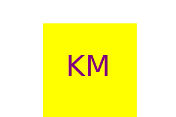
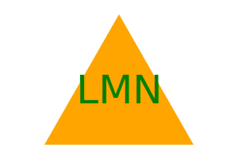

  # svg-logo-maker

  ## Badge
  

  ## Description 
  
  This command-line application takes user input and produces a logo in an .svg file.

  ## Table of Contents 
  - [Installation](#installation) 
  - [Usage](#usage) 
  - [Credits](#credits) 
  - [License](#license) 
  - [Questions](#questions)
  - [Tests](#tests)

  ## Installation Instructions 
  
  You must have a code editor (I use Virtual Studio Code) and node.js. 

  ## Usage 
 
  In the integrated terminal, type node index.js and then answer the questions that follow. Once the questions are complete, a logo.svg file will generate.

  ## Link to Walkthrough

  https://drive.google.com/file/d/1h7TbzCekWLDKGyiCC__1MhOXwmmk_FOW/view

  ## Credits   
 
  Worked with tutor: Faran Navazi
  
  ## License 
 
  This application is covered under the following license:
    [MIT License](https://opensource.org/licenses/)
  
  ## Questions
  
  - github.com/pcrainer38
  - pammie_78704@yahoo.com
  
  ## Tests 
  
   I have created 3 passing tests that test the generation of the three acceptible shapes used by the program.  To run them, type npm run test in the integrated terminal.

  ## Images

 

 

 